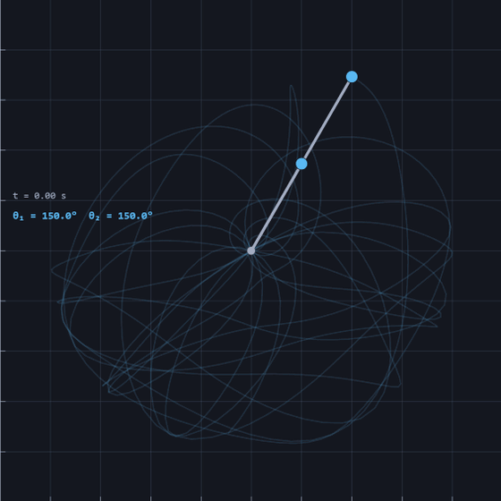
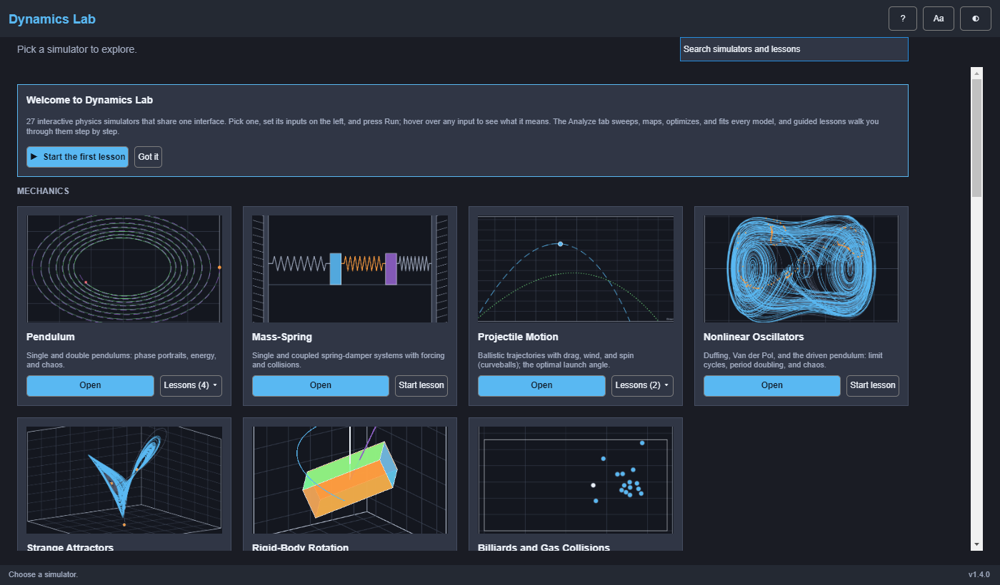
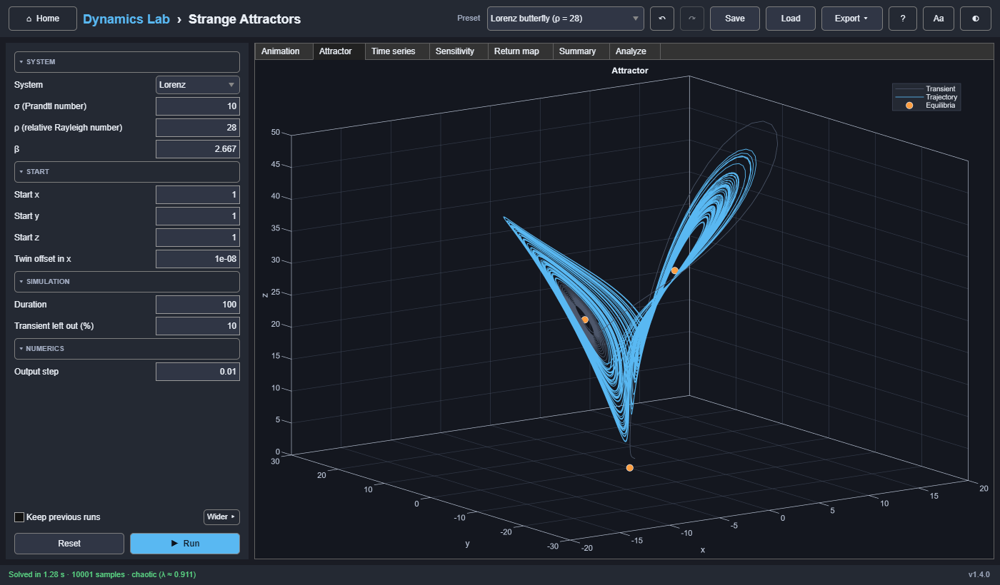
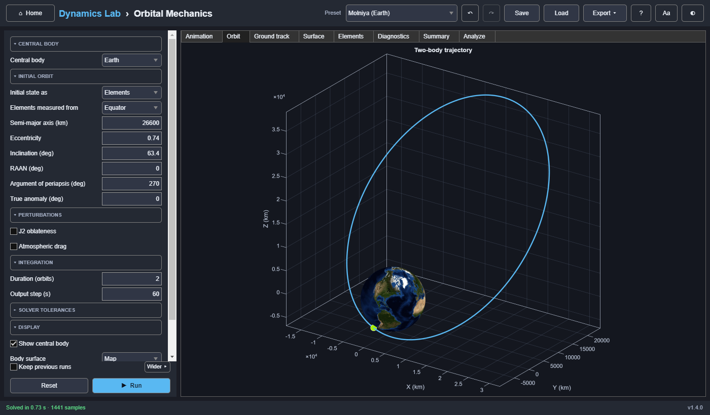
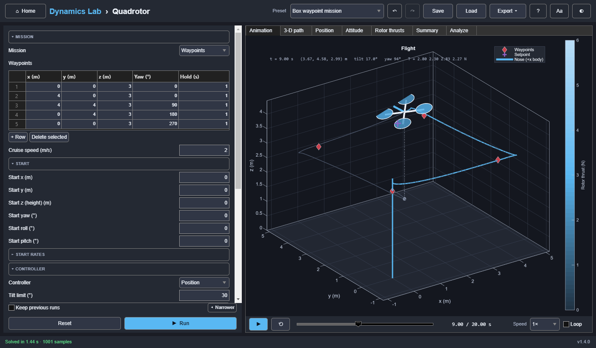
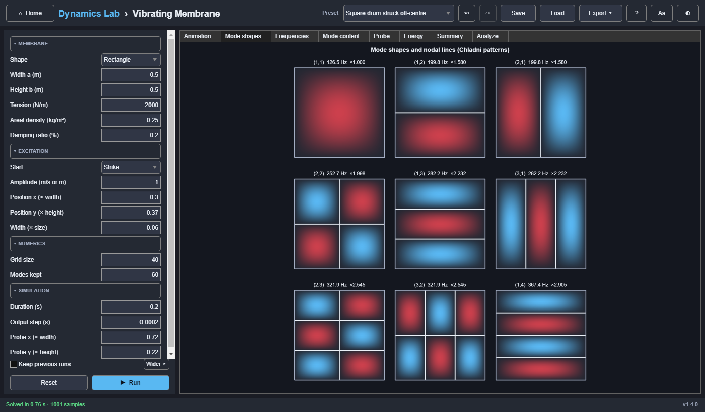

# Dynamics Lab

**Twenty-seven interactive physics and engineering simulators in one MATLAB app.** Pendulums and
strange attractors, a DC motor servo and a quadcopter, orbits and gravity assists, trusses and
vibrating drums: every one works the same way. Set the inputs, press **Run**, and explore the
animation, plots, and key numbers. Then sweep, map, optimize, or fit any model, find its natural
modes and frequency response, or follow a guided lesson.

[](https://github.com/ParallelLivid/dynamics-lab/actions/workflows/ci.yml)


[](LICENSE)



## Try it

| | |
|---|---|
| **In your browser** | [](https://matlab.mathworks.com/open/github/v1?repo=ParallelLivid/dynamics-lab&file=DynamicsLab.m) <br> Opens the code in MATLAB Online; press **Run**. A free MathWorks account includes 20 hours a month. |
| **In MATLAB R2025b** | Download `DynamicsLab.mltbx` from the [latest release](https://github.com/ParallelLivid/dynamics-lab/releases/latest), double-click it, then type `DynamicsLab`. No toolboxes needed. |
| **Without MATLAB** (Windows) | Download and run `DynamicsLabInstaller.exe` from the [latest release](https://github.com/ParallelLivid/dynamics-lab/releases/latest). It also installs the free MATLAB Runtime. |

## Highlights

- **27 simulators in five fields:** mechanics, controls and vehicles, aerospace, structures, and
  continuum (heat and waves), from a single pendulum to 6-DOF flight and multi-stage rockets.
- **One interface for all of them.** Grouped inputs with ranges and tooltips, presets,
  undo/redo, saved scenarios, playback with scrubbing, kept runs for comparison, and exports
  (CSV, MAT, PNG, MP4/GIF, and an HTML report for a lab write-up).
- **Analysis tools that work on every model:** parameter sweeps (including bifurcation
  diagrams), 2-D maps, constrained optimization, Monte Carlo uncertainty, fitting to measured
  data, linearized modes, and Bode plots with gain and phase margins.
- **35 guided lessons** that check your answers as you go, from "How long does a swing take?" to
  the entry corridor of a returning capsule.
- **Scripting:** every simulator also runs from code (`dlab.run`, `dlab.sweep`), with the same
  defaults, presets, and input checks as the app.
- **Checked against independent results.** Each simulator has a verification sheet comparing it
  with closed forms, published values, and separate calculations, and more than 1,400 automated
  tests run on every push.
- **Base MATLAB only**: no toolboxes. Written as a plugin framework, so a new simulator is one
  package that the shell, the analysis tools, and the tests pick up by themselves.

## Gallery

| | |
|---|---|
|  |  |
| **Home:** search, recent work, lessons | **Strange attractors:** the Lorenz butterfly |
|  |  |
| **Orbital mechanics:** a Molniya orbit over a textured Earth | **6DOF flight:** a Dutch roll from trim |
|  |  |
| **Quadrotor:** a waypoint mission with cascaded control | **Vibrating membrane:** a drum's modes |

## The simulators

| Simulator | What it covers |
|---|---|
| **Mechanics** | |
| [Pendulum](docs/sims/pendulum.md) | Damped nonlinear pendulum, single or double: phase portrait, energy, chaos |
| [Mass-Spring](docs/sims/massspring.md) | Single and coupled spring-damper systems, forcing, collisions |
| [Projectile Motion](docs/sims/projectile.md) | Ballistic trajectories with optional drag, wind, thinning air, and spin (backspin, curveballs); the optimal angle |
| [Nonlinear Oscillators](docs/sims/nonlinear.md) | Duffing, Van der Pol, and the driven pendulum: limit cycles, Poincaré sections, period doubling, chaos |
| [Strange Attractors](docs/sims/attractors.md) | Lorenz, Rössler, and Chua: sensitive dependence, Lyapunov exponents, return maps |
| [Rigid-Body Rotation](docs/sims/rigidbody.md) | Tumbling bodies and spinning tops: the tennis racket flip, polhodes, precession, and nutation |
| [Billiards and Gas Collisions](docs/sims/collisions.md) | Event-driven hard discs: billiards, the Maxwell speed distribution, pressure, Brownian motion |
| **Controls & Vehicles** | |
| [DC Motor Servo](docs/sims/dcmotor.md) | A DC motor in open loop or as a speed or position servo: time constants, P/PI/PD/PID tuning, load torque, saturation and integrator windup |
| [Inverted Pendulum on a Cart](docs/sims/cartpole.md) | Balancing an unstable pole with PID or LQR control, within a motor's force limit |
| [Quarter-Car Suspension](docs/sims/quartercar.md) | A car's suspension over bumps, potholes, and ISO rough roads: comfort against road holding |
| [Vehicle Handling](docs/sims/handling.md) | A car steering on the bicycle model: understeer and oversteer, the critical speed, lane changes, and the tyre limit |
| **Aerospace** | |
| [Orbital Mechanics](docs/sims/orbit.md) | Orbits around planets, the Moon, or the Sun, with J2 oblateness and atmospheric drag; ground tracks over textured, relief-shaded surfaces |
| [Orbital Maneuvers](docs/sims/maneuvers.md) | Hohmann and bi-elliptic transfers, plane changes, phasing, and the Δv budget |
| [Gravity Assist](docs/sims/flyby.md) | A planetary flyby: hyperbola and turning angle in the planet's frame, the slingshot's speed gain and new orbit in the Sun's frame |
| [Three-Body Problem](docs/sims/threebody.md) | Lagrange points, zero-velocity curves, the Arenstorf orbit, and N-body choreographies |
| [Rocket Ascent](docs/sims/rocket.md) | Multi-stage launch to orbit: gravity turn, max-Q, staging, and the Δv budget |
| [Atmospheric Entry](docs/sims/entry.md) | Capsule entry over a curved Earth: deceleration, Sutton–Graves heating, skip-out, the entry corridor, and the Allen–Eggers ballistic solution |
| [Spacecraft Attitude Control](docs/sims/attitude.md) | Reaction wheels and thrusters: tumbling, detumbling, quaternion PD and bang-bang slews, and wheel saturation under a disturbance |
| [6DOF Flight](docs/sims/flight6dof.md) | Rigid-body flight dynamics: trim, control doublets, mode identification, wind, quaternion attitude, autopilot |
| [Quadrotor](docs/sims/quadrotor.md) | Quadcopter flight control: cascaded position/attitude loops, rotor mixing and saturation, waypoints, wind, and a motor failure |
| **Structural** | |
| [2-D Truss Solver](docs/sims/truss.md) | Member forces, reactions, and displacements of pin-jointed trusses; a strength check (yield and buckling) for each member's section; drag nodes to reshape |
| [2-D Frame and Beam Solver](docs/sims/frame.md) | Beams and rigid frames: deflections, reactions, and bending moment, shear, and axial force diagrams |
| [Column Buckling](docs/sims/column.md) | Euler loads for four end conditions, imperfect columns and first yield, the Southwell plot, and the elastica past buckling |
| **Continuum** | |
| [Vibrating String and Beam](docs/sims/wave.md) | Standing waves, harmonics, and mode shapes of strings and beams |
| [Vibrating Membrane](docs/sims/membrane.md) | Square and circular drums: 2-D modes by finite differences, Chladni nodal lines, Bessel zeros, and why where you strike decides which modes ring |
| [1-D Heat Conduction](docs/sims/heat.md) | Explicit, implicit, and Crank–Nicolson schemes; stability; fixed, flux, and convection ends |
| [Heat in a Plate](docs/sims/plate.md) | 2-D conduction with explicit and ADI schemes, the r ≤ ¼ stability limit, fixed/flux/convection edges, heaters, and an exact energy balance |

Each simulator's page gives its model (equations, units, assumptions), its inputs and presets,
what each tab shows, and the sources it was checked against.

## Getting started

You need **MATLAB R2025b**. No toolboxes are required.

```bash
git clone https://github.com/ParallelLivid/dynamics-lab.git
```

Then, in MATLAB, from the repository folder:

```matlab
DynamicsLab                           % the Home screen
DynamicsLab("orbit")                  % or open one simulator directly
DynamicsLab(Scenario="my.json")       % or open a saved scenario
```

The first time it opens, Home shows a short welcome with a button that starts the first lesson.

## Using the app

Every simulator has the same layout: inputs on the left, output tabs on the right.

- **Inputs** are grouped into sections; advanced ones start collapsed, and sections that do not
  apply to the current choices are hidden. Hover over any input for its meaning and allowed range.
  Lists of things (rocket stages, maneuver burns, waypoints, frame members) are edited as tables;
  simulators with tables open with a wider input panel, and **Wider ▸ / ◂ Narrower** switches.
- **Presets** load ready-made scenarios; editing an input switches to *Custom*.
- **Run** solves the model (Ctrl+R). While it runs, the button becomes **Cancel** (Esc) and the
  status bar shows progress. Changing an input afterwards marks the results as out of date.
- **Animation** has play, scrub, speed (0.25×–8×), and loop controls.
- **Summary** lists the run's key numbers; **Runs** compares kept runs side by side when
  **Keep previous runs** is ticked (up to 12, drawn faintly behind the current one).
- **Save / Load** store inputs as scenario files, which also appear in the preset list.
- **Undo / redo** (↶ ↷, Ctrl+Z / Ctrl+Y) step through input changes, presets included.
- **Export** writes the data (CSV or MAT), the current plot, the whole window, the animation (MP4
  or GIF), or an HTML **report** with the inputs, the Summary, and every plot.
- **◐** switches between dark and light themes and **Aa** cycles the text size; your inputs and
  results are kept.

**Keyboard:** Ctrl+R or F5 run, Esc cancel, Ctrl+Z / Ctrl+Y undo and redo, Ctrl+S / Ctrl+O save
and load, Space play/pause, ← / → step (Shift: 10 frames), and Home to rewind.

Scenarios, exports, settings, your own lessons, and an error log are kept in
`Documents\DynamicsLab`.

### The Analyze tab

| Tool | What it does |
|---|---|
| **Custom plot** | Plots any two result columns against each other, with measured data on top |
| **Sweep** | Varies one input over a range and plots any key result against it; results with many values per run (such as Poincaré points) draw a bifurcation diagram |
| **Map** | Varies two inputs over a grid and shows a key result as a heat map; click a cell to use its inputs |
| **Optimize** | Finds up to three inputs that maximize or minimize a result, optionally keeping another result within a limit |
| **Uncertainty** | Gives inputs a tolerance and runs a seeded Monte Carlo study: histograms, 5–95 % bands, and which input matters most |
| **Fit** | Imports a CSV of measurements and fits up to three inputs to it, with standard errors and residuals |
| **Modes** | Linearizes the model and lists its modes (frequency, damping, stability), named where the physics names them: phugoid and Dutch roll, body bounce and wheel hop, the tennis racket's tumble |
| **Bode** | Gain and phase from any input to any output, with bandwidth, resonance, and gain and phase margins |

### Lessons

A lesson opens beside its simulator and walks through it step by step: what to try, a button that
loads the right setup, and a **Check** button that says whether you got there and why. There are
35, at least one per simulator, started from each Home card (a card with several has a
**Lessons ▾** menu). [docs/lessons.md](docs/lessons.md) explains how to write your own.

## Scripting

```matlab
out = dlab.run("projectile", theta=30, v0=40);       % out.Summary, out.Data, out.Result, ...
out = dlab.run("orbit", Preset="Molniya (Earth)");
T = dlab.sweep("projectile", "theta", 5:5:85);       % one row per angle, with units
T = dlab.sweep("pendulum", "theta0", 10:10:170, b=0);
dlab.simulators()                                    % the simulators
dlab.simulators("pendulum")                          % one simulator's inputs and ranges
```

## How it is built

```text
DynamicsLab.m            entry point
+dlab/+core/             the shell: window, Home, simulator view, input panel, playback,
                         scenarios, exports and reports, the Analyze tools, lessons
+dlab/+physics/          shared physics and numerics: atmosphere, quaternions, orbital
                         elements, gravity, section properties, spectra, Jacobians
+dlab/+ui/               theme tokens (dark and light, three text sizes) and components
+dlab/+sims/+<id>/       one package per simulator: its physics engine and a plugin class
+dlab/run.m, sweep.m     the scripting API
resources/               lessons (JSON), Home thumbnails, planet textures, sample data
tests/                   the test suite
docs/                    a page per simulator, the plugin API, lessons, verification sheets
```

A simulator is a **plugin**: a class that declares its inputs, presets, output tabs, and summary,
and draws into the axes the shell gives it. The shell supplies everything else (inputs panel,
playback, undo, exports, the Analyze tools, lessons), so every simulator gets every feature.
Plugins never depend on each other; shared physics lives in `+dlab/+physics` behind golden tests.
The contract is in [docs/plugin-api.md](docs/plugin-api.md) and
[docs/adding-a-simulator.md](docs/adding-a-simulator.md).

### Verification

Each simulator was verified one at a time against values worked out independently of its engine:
closed-form solutions, published results, and separate calculations, for the defaults, every
preset, and the edge cases. Each has a sheet in [docs/verification/](docs/verification/README.md)
with the model as implemented, the reference values, what was found, and how it was fixed. That
pass found 273 problems, from wrong signs and mirrored views to labels that overlapped, and the
kinds it found most are now checked by the build for every simulator.

### Tests

```matlab
buildtool          % Code Analyzer (zero issues allowed) + the full test suite
buildtool ptest    % the suite in five parallel MATLAB sessions (about 25 minutes)
buildtool fasttest % only the tests that open no windows (a few minutes)
buildtool images   % re-render the Home thumbnails and the screenshots in docs/images
```

The suite covers each engine against reference results, every simulator end to end in the app, the
shared framework and physics library, a conformance suite every plugin must pass, every shipped
lesson worked through with its solutions, and architecture rules (such as no simulator depending
on another). GitHub Actions runs it on every push.

### Adding a simulator

```matlab
dlab.dev.newSimulator("doublependulum", "Double Pendulum")
```

This creates a working plugin around a placeholder model, with its tests, docs page, lesson,
verification sheet, and Home thumbnails, and registers it, so the whole suite passes before any
physics is written. Then replace the placeholder physics.

### Toolbox

```matlab
buildtool toolbox   % Code Analyzer check, then dist/toolbox/DynamicsLab.mltbx
```

Base MATLAB only. Pushing a version tag (`v1.4.0`) runs `.github/workflows/release.yml`,
which builds the toolbox and attaches it to that tag's GitHub release.

### Standalone app

```matlab
buildtool package   % checks + tests, then dist/app/DynamicsLab.exe and dist/installer/
```

This needs **MATLAB Compiler**. People who install the app need only the free MATLAB Runtime,
which the installer downloads.

## History

Dynamics Lab began as six separate MATLAB apps, merged here with their full commit history once
each simulator matched its original:
[pendulum](https://github.com/ParallelLivid/matlab-pendulum-sim),
[mass-spring](https://github.com/ParallelLivid/matlab-mass-spring-sim),
[projectile motion](https://github.com/ParallelLivid/matlab-projectile-motion-sim),
[orbital mechanics](https://github.com/ParallelLivid/matlab-orbit-sim),
[6DOF flight](https://github.com/ParallelLivid/matlab-6dof-flight-sim), and the
[2-D truss solver](https://github.com/ParallelLivid/matlab-truss-solver). The other
twenty-one were written for it. The [CHANGELOG](CHANGELOG.md) records each release.

## Credits

The Orbit simulator's Earth imagery is NASA's Blue Marble Next Generation (public domain). Earth
and Mars topography come from spherical-harmonic models of SRTM and MOLA data (public domain) by
M. Wieczorek, distributed with the SHTOOLS example data (BSD-3-Clause). See
[docs/sims/orbit.md](docs/sims/orbit.md#surfaces). The textbooks and papers each simulator was
checked against are cited on its page.

## License

MIT. See [LICENSE](LICENSE).
