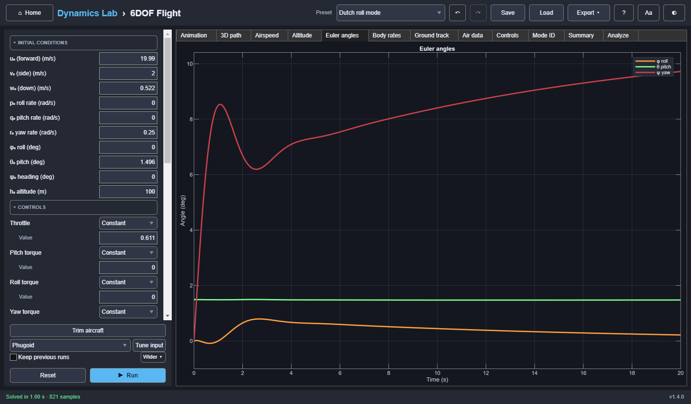

# 6DOF Flight

Rigid-body flight dynamics of a small aircraft model, with presets for trimmed flight, a glide,
and the classic dynamic modes.



## Model

**Wind** (steady; no gusts): a horizontal wind (speed, and the direction it blows from), the same
at every height or stronger with height as `speed·(h / h_ref)^(1/7)`, plus a vertical wind
(thermals, downdrafts). u, v, w and the track stay over the ground; lift, drag, α, β, and the
airspeed use the velocity relative to the air. With **Initial velocity relative to the air** (the
default when there is wind) a trimmed aircraft stays trimmed and simply drifts; relative to the
ground, the wind arrives as a sudden gust and upsets the trim. A uniform wind leaves the Modes tab
unchanged.

The model has 13 states:
- body velocities u, v, w
- body rates p, q, r
- attitude as a unit quaternion (scalar first, body to north-east-down), kept at unit length by
  a small correction term
- north/east/down position

The quaternion has no singularity, so the aircraft can fly vertically and loop. Under
Solver and limits, **Attitude: Euler** integrates φ, θ, ψ instead (12 states, as
before version 1.2). Euler angles are singular at ±90° pitch, so those runs stop at the pitch
limit. Plots and exports show Euler angles either way; quaternion runs also export q₀–q₃.
Scenario files from before 1.2 load with Euler angles, so they reproduce exactly.

Lift saturates smoothly at CL max. Drag is CD₀ + CDα²·α². Air density follows the standard
atmosphere. Stability terms provide pitch stiffness, roll and yaw response to sideslip, and rate
damping. They are angular accelerations that stay the same at every airspeed:

```text
ṗ = (Kctrl·aileron + (Iy − Iz) q r)/Ix − damp_p·p − roll_β·β
q̇ = (Kctrl·elevator + (Iz − Ix) p r)/Iy − damp_q·q − pitch_α·(α − α_trim)
ṙ = (Kctrl·rudder + (Ix − Iy) p q)/Iz − damp_r·r + yaw_β·β
```

(α is limited smoothly to ±60°, and the α terms fade out as the sideslip nears 90°.) In a real
aircraft they grow with the dynamic pressure, so this model's modes change with speed
differently from an aircraft's: its phugoid, for instance, is heavily damped (ζ ≈ 0.6) and slower
than Lanchester's π√2·V/g.

The control inputs are normalized body torques. Each can be constant or change during the run
(a step, pulse, doublet, ramp, sine, or custom points), for example a rudder doublet to excite
the Dutch roll:

```text
moment = Kctrl × command        (command between −1 and 1)
```

They are meant for exploring stability and modes. They don't model real control surfaces, whose
authority changes with airspeed.

The run stops at ground contact, at the maximum airspeed, at the pitch limit, or at the wall-clock
limit. An early stop is reported in orange in the status bar.

**Scope:**
- flat, non-rotating NED frame
- steady wind only (no gusts or turbulence), and constant mass

The model is for education and qualitative experiments. It is not suitable for certification,
control-surface sizing, or high-angle aerobatics.

## Trim

**Trim aircraft** (below the inputs) solves for wings-level steady flight at the Trim airspeed,
altitude, and flight-path angle: the angle of attack, throttle, and pitch torque that make
du/dt = dw/dt = dq/dt = 0 (Newton's method on the model itself). It sets the initial state and
the controls in one undo step; a control that is a doublet or pulse keeps its shape and rides on
the trim value. It explains requests it cannot meet: more than full throttle, negative thrust,
or an angle of attack past the stall.

## Exciting and identifying modes

Pilots excite modes with short control inputs: a rudder doublet for the Dutch roll, a roll pulse
for roll subsidence, a pitch pulse for the phugoid. **Tune input** sizes one to the chosen mode
of the linear model on the Modes tab: a doublet whose period equals the mode's period, or a pulse
about half its time constant, and a duration long enough to watch it decay.

The **Mode ID** tab then fits the free response after the input with damped exponentials (the
matrix pencil method, `dlab.physics.fitDampedResponse`) and compares the measured period, damping
ratio, or time constant with the linear model's. It uses the yaw rate (Dutch roll), roll rate
(roll subsidence), bank angle (spiral, after the Dutch roll has died away), or airspeed
(phugoid). **Identify mode** (Analysis) picks the mode from the excited control, or you can
choose it. In this aircraft model the short period is a fast, overdamped real mode (time constant
about 0.05 s), so it is not identified.

The **Controls** tab plots the four commands over time.

## Autopilot

Three holds, each added to the pilot's inputs (so a trim and a doublet still act underneath, and
the autopilot works against them):

```text
altitude   θc = α_trim + Kh·e_h + Khi·∫e_h − Khd·ḣ    (within ±pitch limit of α_trim)
           pitch torque += Kθ (θc − θ) − Kq·q
heading    φc = Kψ·(ψref − ψ, wrapped to ±180°)       (within ±bank limit)
           roll torque  += Kφ (φc − φ) − Kp·p
airspeed   throttle     += Kv·e_V + Kvi·∫e_V
```

with e_h = h_ref − h and e_V = V_ref − V (airspeed, relative to the air). The controls are then
clipped to their ranges. The two integrals are extra states of the integration; each runs only
inside its capture band (5 m, 3 m/s) and while its output is not saturated, so a large climb or
speed change does not wind it up and overshoot. Because the aircraft holds its angle of attack
strongly, a pitch command is in effect a climb-angle command, and the altitude loop behaves like
a first-order lag. Airspeed hold is an autothrottle: use it with altitude hold, as more thrust
alone only makes the aircraft climb.

The default gains suit the default aircraft (Autopilot gains, collapsed). The Controls tab shows
the controls actually applied, and the references are drawn on the Altitude, Airspeed, and Euler
angle plots. The Modes tab still shows the aircraft without the autopilot.

## Inputs

| Group | Inputs |
|---|---|
| Initial conditions | u₀, v₀, w₀, p₀, q₀, r₀, φ₀, θ₀, ψ₀, altitude |
| Controls | Throttle (0–1), pitch, roll, and yaw torque (±1), each constant or a time profile |
| Simulation | Duration |
| Autopilot | Hold altitude, heading, and airspeed, each with its reference |
| Autopilot gains *(collapsed)* | Kh, Khi, Khd, Kθ, Kq, Kψ, Kφ, Kp, Kv, Kvi; pitch and bank limits; capture bands |
| Wind | Speed, from (direction), vertical wind, profile (uniform or stronger with height), reference height, and whether the initial velocity is relative to the air or the ground |
| Aircraft *(collapsed)* | Mass, inertias, wing area, maximum thrust, lift slope, CL max, drag terms, Kctrl, rate damping |
| Stability *(collapsed)* | Trim angle of attack, pitch stiffness, roll and yaw from sideslip |
| Solver and limits *(collapsed)* | Maximum airspeed, ground altitude, attitude (quaternion or Euler angles), pitch limit (Euler only), ODE solver, tolerances, maximum step, wall-clock limit |
| Display | Plot points (plots are resampled to this many) |
| Trim | Trim airspeed, altitude, and flight-path angle (for the Trim aircraft button) |
| Analysis | Identify mode (automatic, phugoid, Dutch roll, roll subsidence, spiral, or off) |

**Presets:** straight flight, glide, phugoid, short-period, Dutch roll, roll subsidence, and loop
(a pitch-torque pulse of 0.06 for 4.5 s at 25 m/s: one loop, which the Euler-angle option cannot
fly), crosswind (10 m/s from the west), and four excitations from trim: Dutch roll (yaw doublet),
roll subsidence (roll pulse), spiral (small roll pulse, 60 s), and phugoid (pitch pulse, 150 s),
and three autopilot runs: a climb to 150 m, a turn to 90° holding altitude and speed, and the
phugoid's pitch pulse ridden out with altitude and airspeed hold. Each sets the initial
disturbance, duration, and relevant parameters. Changing anything except the
duration switches the preset to Custom.

## Outputs

- **Animation:** ghost path, trail, aircraft marker, and body axes, with telemetry. Playback
  interpolates between samples.
- **3D path, Airspeed** (with ground speed when there is wind), **Altitude, Euler angles, Body
  rates, Ground track** (with the wind noted), and **Air data** (angle of attack and sideslip).
- **Controls:** the controls applied (the pilot's inputs plus any autopilot correction).
- **Summary:** termination, final time, altitude, airspeed, horizontal range, and solve time; with
  wind, the final ground speed, the wind drift, and the crab angle (heading minus track); with the
  autopilot, each hold's error at the end. The final altitude, airspeed, range, heading, and those
  errors are numeric results for sweeps (sweep Kh and plot the altitude error, for example).
- **Modes:** the model linearized about the initial state (u, v, w, p, q, r, φ, θ, ψ, at the
  initial altitude), with each mode named: phugoid, short period, Dutch roll, roll subsidence,
  spiral, and heading. A warning appears when the initial state is not trimmed.
- The export table includes the four control commands, the airspeed, α, and β over time.

## Reference results (asserted by the tests)

Each preset run for 20 s:

| Preset | Termination | Final altitude | Final airspeed | Horizontal range |
|---|---|---:|---:|---:|
| Straight flight | completed | 100.00 m | 20.00 m/s | 400.00 m |
| Glide | completed | 69.99 m | 6.99 m/s | 150.16 m |

Trim at 20 m/s and 100 m reproduces the Straight flight preset (α = 0.0261044803493 rad, throttle
0.6109817636934) within 10⁻⁹. Identified from the excitation presets, against the linear model:
Dutch roll period 3.24 s (within 3 %), roll subsidence 0.65 s (1/1.5 s, within 5 %), spiral
14.0 s (1/0.0712 s, within 5 %), and phugoid within 10 %.

Autopilot, from straight flight: climbing 50 m, turning 90°, and speeding up 2 m/s together, it
ends within 1 m, 1°, and 0.2 m/s of the references in 60 s, overshoots the altitude by less than
5 m, and banks less than 36°. With altitude and airspeed hold, a pitch pulse's phugoid dies out
within 0.5 m after 40 s (without them it is still more than 2 m out). With every hold off the
run is identical to one without an autopilot.

A trimmed aircraft in a 5 m/s uniform crosswind, started relative to the air, holds 100 m and
20 m/s airspeed within 10⁻⁶ and drifts exactly 5 m/s downwind. With no wind the results are
identical to the windless model.

The quaternion and Euler-angle options agree on every preset (angles within 10⁻⁵ rad, positions
within 1 mm, at tight tolerances), and the quaternion's norm stays 1 within 10⁻⁹. The loop turns
330–400° in pitch and ends within 20° of level.

Straight flight is trimmed for level flight at 20 m/s and 100 m (angle of attack 1.4957°,
throttle 0.6110), and the mode presets start from that trim. Before version 1.1.0 the density
used the ISA pressure exponent (5.256 instead of 4.256), which was about 0.2 % low at 100 m and
jumped at 11 km. The Glide reference then was 69.97 m, 6.99 m/s, and 150.30 m.
