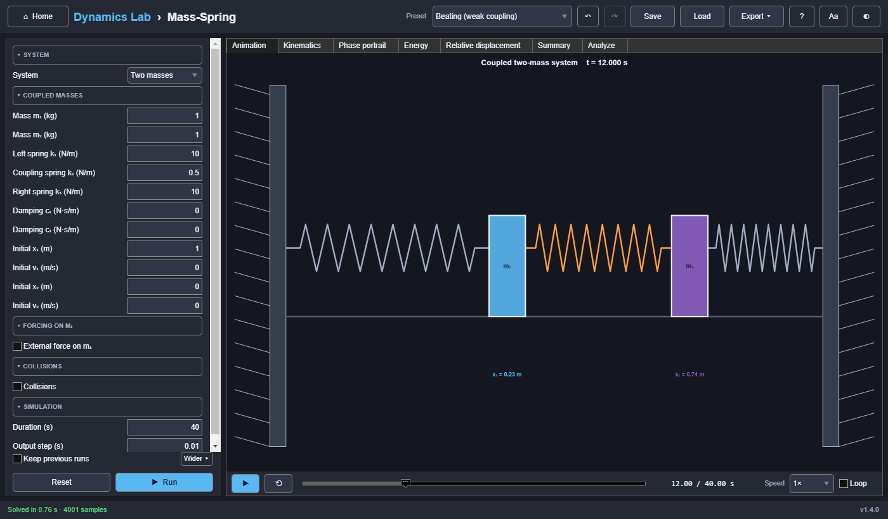

# Mass-Spring

Single and coupled mass-spring-damper systems, with harmonic or profile forcing and, in the coupled case,
rigid wall and mass-to-mass collisions.



## Model

**Single mass**

```text
m x'' + c x' + k x = F₀ cos(ωf t + φ)
```

**Coupled masses.** Springs k₁ (left wall to m₁), k₂ (m₁ to m₂), and k₃ (m₂ to the right wall).
Dampers c₁ and c₂ connect each mass to its wall. Forcing acts on m₁.

```text
m₁ x₁'' = F(t) − c₁ x₁' − k₁ x₁ − k₂ (x₁ − x₂)
m₂ x₂'' =      − c₂ x₂' − k₃ x₂ + k₂ (x₁ − x₂)
```

x₁ and x₂ are displacements from equilibrium. Collision detection and the animation both use the
physical centre positions:

```text
q₁ = −separation/2 + x₁        q₂ = +separation/2 + x₂
```

- **Wall clearance** is the outward displacement at which a mass touches its wall.
- **Contact gap** is the smallest allowed centre-to-centre distance between the masses.
- **Restitution e** (0 to 1) sets the bounce.

Simultaneous contacts are resolved together. Resting contact is held for as long as the forces
push inward. Starting positions that overlap are rejected. At each impact, the results keep both
the pre-impact and post-impact samples, so the time vector can repeat the event time. An impact
keeps momentum and multiplies the closing speed by e, so a mass hitting a wall keeps e² of its
kinetic energy, and a mass–mass impact loses ½ μ (1 − e²) v_rel², with μ = m₁m₂/(m₁ + m₂).

**Solver.** `ode45` (relative and absolute tolerance 10⁻⁹), sampled at the output step. With a
force profile or collisions it steps no further than the output step, so a short pulse or a
contact cannot fall between steps. Heavy damping (a decay rate over 10⁴/duration) switches to
`ode15s`, which handles the stiff equations.

## Inputs

The **System** choice shows only the relevant sections:

- **Single mass:** m, k, c, x₀, v₀, plus **Forcing**: harmonic (F₀, ωf, φ) or a force profile
  (step, pulse, doublet, ramp, sine, or custom points).
- **Coupled masses:** m₁, m₂, k₁, k₂, k₃, c₁, c₂, initial positions and velocities, plus
  **Forcing on m₁** and **Collisions**.

The collision details appear once Collisions is ticked.

**Presets:** forced near resonance, critically damped, beating (weak coupling), and free impact.

## Outputs

- **Animation:** walls, zig-zag springs, and piston dampers (only those with stiffness or damping
  above zero), with arrows for the displacement, the velocity, and the external force on a single
  mass. An impact burst marks each collision.
- **Kinematics** (x, v, a). In coupled mode, collisions are marked on both sides of each
  velocity jump.
- **Phase portrait** (one per mass) and **Energy**.
- **Single mode:** **Spring force** and **Frequency response**: the magnification
  X / X_st = 1 / √((1 − r²)² + (2ζr)²) and the phase lag of x behind the force,
  atan2(2ζr, 1 − r²), against r = ω/ωn, with the forcing frequency marked.
- **Coupled mode:** **Relative displacement** x₁ − x₂.
- **Summary:** for one mass, the natural frequency ωn = √(k/m), the damping ratio
  ζ = c / (2√(mk)) and its type (undamped, under-, critically, or over-damped), the damped
  frequency ωd = ωn √(1 − ζ²), the magnification at ωf (harmonic forcing), the peak displacement,
  and the final energy. For two masses, the two undamped mode frequencies (from
  det(K − ω²M) = 0), the peak displacements, and the collisions by type.
- **Modes (Analyze):** the free (unforced) system's modes; for two masses, the in-phase and
  out-of-phase modes. Their natural frequency is |λ| of the damped system, which differs slightly
  from the Summary's undamped values when the damping is not proportional.
- **Bode (Analyze):** the response to a force on the (first) mass. For one mass, x/F is
  1 / (k − mω² + icω): 1/k at low frequency, a resonance near ωn, and −40 dB per decade above
  it.

## Reference results (asserted by the tests)

| Scenario | Check | Value |
|---|---|---:|
| Forced near resonance (m = 1, k = 10, c = 0.5, F₀ = 2 N at 3 rad/s, x₀ = 0.5) | x, v at t = 7.99 s | −0.625311 m, 2.422675 m/s |
| Free impact (m₁ = 1, m₂ = 1.5 kg, e = 0.75, 0.8 and −0.4 m/s) | first impact | t = 0.916667 s |
| | velocities after impact | −0.46 m/s, 0.44 m/s |
| | kinetic energy before → after | 0.44 J → 0.251 J |
| | momentum (conserved throughout) | 0.2 kg·m/s |
| Defaults (m = 1, k = 10, c = 0.5, x₀ = 1) | ωn, ζ, damped period | 3.16228 rad/s, 0.0790569, 1.99316 s |
| Harmonic forcing, steady state | X / X_st at r = 0.5, 1, 2 | 1.32599, 6.32456, 0.331497 |
| Beating (weak coupling) | mode frequencies √10 and √11 | 3.16228, 3.31662 rad/s |
| Wall impact, e = 0.6 | kinetic energy after / before | e² = 0.36 |
| Bode, defaults | Force → x | 1 / (k − mω² + icω) |
