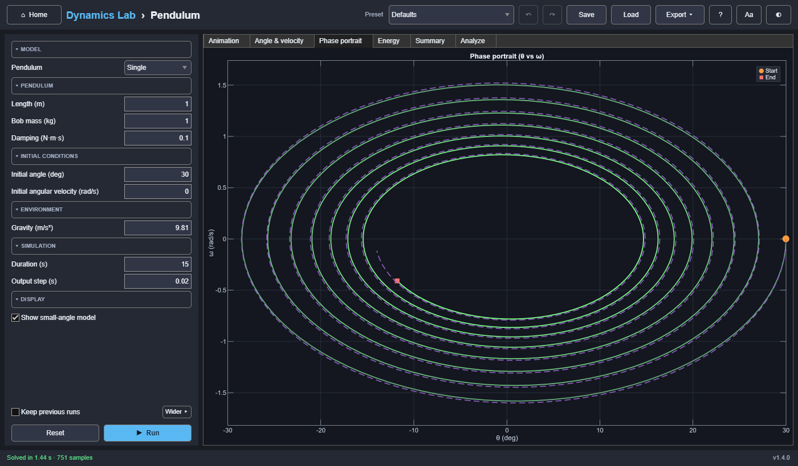

# Pendulum

A damped, nonlinear pendulum, single or double, with an animation, angle and angular-velocity
plots, a phase portrait, and mechanical energy. The double pendulum adds the tools of chaos: a
twin started a hair apart, its divergence, a Lyapunov exponent, and a Poincaré section.



## Model

```text
θ'' + b / (m L²) · θ' + g / L · sin θ = 0
```

- `L` is the length, `m` the bob mass, `b` the rotational damping (torque = −b·ω), and `g` gravity.
- θ is measured from straight down.
- `ode45` handles ordinary cases, and `ode15s` handles strongly damped (stiff) ones.
- Potential energy is zero at the lowest point.

## Small-angle approximation

For small swings sin θ ≈ θ, which turns the model into a linear oscillator:

```text
θ'' + b / (m L²) · θ' + g / L · θ = 0        period T₀ = 2π / √(g/L − (b / 2mL²)²)
```

**Show small-angle model** (Display, on by default) draws its solution from the same start as a
dashed line on the angle, velocity, and phase plots, and as a faint ghost pendulum in the
animation, so you can see where the approximation breaks down. It redraws without re-running.

Without damping the exact period of a swing with amplitude θ₀ is

```text
T = 4 √(L/g) · K(sin²(θ₀/2))
```

where K is the complete elliptic integral of the first kind (`ellipke`). The amplitude is
worked out from the energy, so a push (ω₀ ≠ 0) counts too.

## Double pendulum

Choose **Double** for Pendulum (under Model). A second rod (length L₂) and bob (m₂) hang from the
first bob. Both angles are measured from straight down. Lagrange's equations give

```text
[(m₁+m₂)L₁²            m₂L₁L₂cos(θ₁−θ₂)] [θ₁'']   [−m₂L₁L₂ sin(θ₁−θ₂) θ₂'² − (m₁+m₂) g L₁ sin θ₁ − bθ₁' + b(θ₂'−θ₁')]
[m₂L₁L₂cos(θ₁−θ₂)      m₂L₂²           ] [θ₂''] = [ m₂L₁L₂ sin(θ₁−θ₂) θ₁'² − m₂ g L₂ sin θ₂      − b(θ₂'−θ₁')        ]
```

with damping b at both joints, integrated with `ode45` (relative tolerance 10⁻¹⁰).

- **Twin:** a second double pendulum whose lower angle starts δ higher (default 10⁻³°), run in
  the same integration and drawn faintly. The run reports when the lower bobs are 10 % of the
  total length apart (the divergence time) and fits the exponential growth of their distance.
- **Lyapunov exponent** (optional, about twice the solve time): Benettin's method. A neighbour
  10⁻⁸ away is followed, and every 0.25 s the gap's growth is logged and the gap is reset.
  λ > 0 means chaos.
- **Poincaré section:** (θ₂, ω₂) each time θ₁ passes 0 moving forward. As a set-valued result
  it can be swept: plotting "Poincaré ω₂ (all values)" against the starting angle shows the
  change from regular to chaotic motion.
- **Modes:** linearized about hanging straight down, the in-phase and anti-phase normal modes.
  For equal rods and bobs ω² = (g/L)(2 ∓ √2).

## Inputs

| Group | Inputs |
|---|---|
| Model | Single or double pendulum |
| Pendulum | Length (0.1–10 m), bob mass (0.01–100 kg), damping (0–50 N·m·s); double: lower length and mass |
| Initial conditions | Angle (±180°), angular velocity (±50 rad/s); double: the lower rod's too |
| Chaos *(double)* | Run a twin pendulum, the twin's head start, estimate the Lyapunov exponent |
| Environment | Gravity (0.1–30 m/s²) |
| Simulation | Duration (1–300 s), output step (0.001–1 s) |
| Display | Show small-angle model |

**Presets:** small swing (5°), large swing (170°), undamped, heavily damped, and over the top
(a full rotation, starting at 7 rad/s). Double: gentle (normal modes), chaotic, butterfly effect
(twins 10⁻⁶° apart), and Poincaré section.

## Outputs

- **Animation:** rod, bob, a 3-second trail, and live `t` and `θ` readouts. The angle is
  interpolated between samples, so motion stays smooth at any output step.
- **Angle & velocity, Phase portrait** (colored by time), and **Energy** (kinetic, potential,
  total).
- **Summary:** peak and final angle, the period measured from the swing, initial and final
  energy, energy dissipated, and sample count; then the small-angle period, the exact period
  (undamped swings that don't go over the top), the small-angle model's period error, and its
  largest deviation from the simulated angle.
- **Modes:** the linearized pendulum about the nearest equilibrium (hanging, or balanced upside
  down when it starts above the horizontal), with its small-angle period.
- **Double pendulum:** Angles (both rods, the twin, and the small-angle model), Phase portrait,
  Energy, Divergence (log distance from the twin with its exponential fit, and the Lyapunov
  estimate over time), and Poincaré section. The Summary adds peak angles, lower-rod flips,
  energy drift, divergence time and growth rate, the Lyapunov exponent, and the small-angle
  normal-mode periods.

## Reference results (asserted by the tests)

| Check | Value |
|---|---:|
| Default run: samples, final time | 751, 15 s |
| Default run: final angle, final energy | −11.796865°, 0.290997 J |
| Undamped relative energy variation | about 3.6 × 10⁻⁹ |
| 5° period vs. the small-angle formula 2π√(L/g) | 0.071 % difference |
| Exact (elliptic) period vs. measured, 10°/90°/150° | within 0.1 % |
| Double, in-phase mode (θ₂ = √2 θ₁, 2°): period vs. 2π/√((g/L)(2 − √2)) = 2.6211 s | within 0.05 % |
| Double, m₂ → 0: upper rod vs. the single pendulum | within 10⁻⁴ rad |
| Double, chaotic (120°/−20°), undamped: relative energy drift over 30 s | below 10⁻⁷ |
| Double, Lyapunov exponent: chaotic (120°/−20°) / regular (5°/5°) | 0.5–3 / below 0.1 per second |
