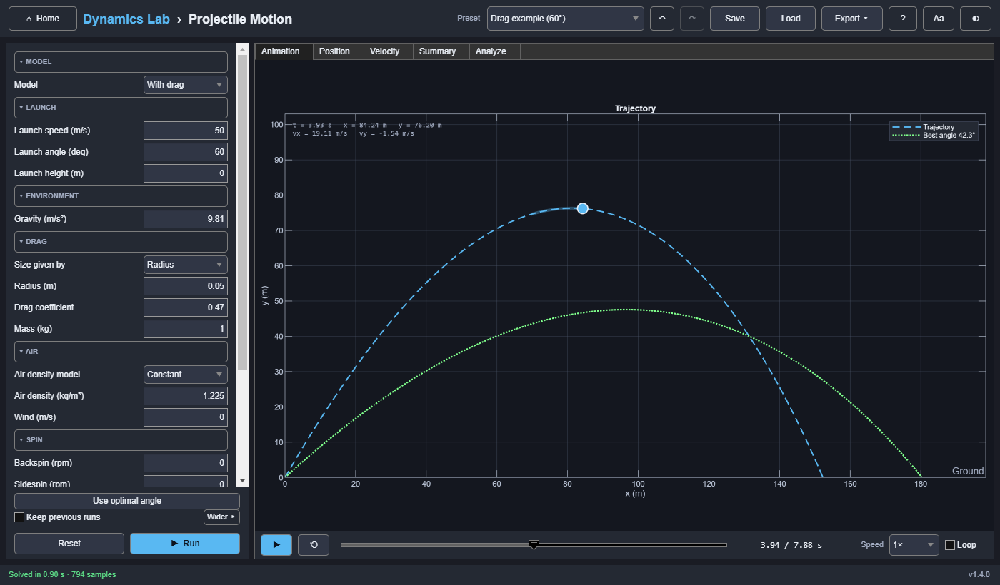

# Projectile Motion

A point mass, or a sphere with quadratic drag, launched from a height and followed until its first
ground impact. The drag model can add a steady wind, air that thins with altitude, and spin
(the Magnus force: backspin, topspin, and curveballs), and every run can find the launch angle with
the longest range. Several runs can be compared side by side.



## Model

**Point mass** (exact):

```text
x(t) = v₀ cos θ · t
y(t) = h₀ + v₀ sin θ · t − g t² / 2
```

**With drag** (a sphere, or a body of given frontal area):

```text
dv/dt = g − (ρ(y) Cd A / 2m) |v − w(y)| (v − w(y))
```

Drag acts on the velocity relative to the air. `w` is a horizontal wind (positive downrange), the
same at every height or growing with height as `w·(y / 10 m)^(1/7)` (a boundary layer). The
density `ρ` is a constant, or the standard atmosphere (`dlab.physics.atmosphere`) at the launch
site's altitude plus the projectile's height (the 1976 standard, taking the altitude as geopotential:
under 0.1 % off at 8 km). With no wind and constant density the equations are exactly the original
ones. The terminal velocity in still air is `v_t = √(2 m g / (ρ Cd A))`, about 65.9 m/s for the
default ball.

**Spin** (sphere only). Backspin and sidespin (rpm) make a spin vector
`ω = (2π/60)·(0, −sidespin, backspin)`, with x downrange, y up, and z to the right looking
downrange. The Magnus force acts across the air-relative velocity:

```text
F = ½ ρ A C_L |v − w|² (ω̂ × v̂),   C_L = 1.5 S (S < 0.1),  0.09 + 0.6 S (S ≥ 0.1),   S = r|ω| / |v − w|
```

(the lift-coefficient fit is Sawicki, Hubbard and Stronge, *Am. J. Phys.* 71, 2003, from baseball
measurements). r is the radius, or `√(A/π)` when the size is given as a frontal area. ω̂ × v̂ has
length 1 for backspin, which is always across the flight; for sidespin it shrinks with the climb or
descent angle, as the force is across both the spin axis and the velocity. Backspin lifts the ball, topspin (negative backspin) makes it dip, and sidespin
curves it: positive to the right, negative to the left, and the flight becomes 3-D. The spin rate
is held constant through the flight. Without spin the 2-D equations above run unchanged.

The drag model is integrated adaptively, using ode45, or ode15s when drag makes the problem stiff.
The ground impact is located exactly. `dt` is the maximum solver step (drag model) or the sample
interval (point mass).

**Optimal angle** (Analysis › Find the optimal angle, on by default). For a point mass it is exact:

```text
θ* = atan(v₀ / √(v₀² + 2 g h₀)),   R* = v₀ √(v₀² + 2 g h₀) / g
```

With drag it is searched for: the range every 5° from 5° to 85°, then `fminbnd` within 5° of the
best, to 0.01° (about 30 extra solves). The best arc is drawn dotted, the Summary reports how much
range the chosen angle loses, and **Use optimal angle** (below the inputs) sets it, as one undo
step.

**Assumptions:**
- flat ground and uniform gravity
- a constant drag coefficient
- a steady, horizontal wind; spin at a constant rate (no spin decay); no buoyancy (so the air
  density must stay well below the projectile's own: not water) or Coriolis effects
- constant mass and frontal area

The impact angle is measured from the horizontal; downward impacts are negative.

## Inputs

| Group | Inputs |
|---|---|
| Model | Point mass, or With drag (a sphere) |
| Launch | Speed (0–5000 m/s), angle (0–90°), height (0–100 km) |
| Environment | Gravity (Earth 9.81, Moon 1.62, Mars 3.72 m/s²) |
| Drag (sphere only) | Size as radius or frontal area, Cd, mass |
| Air (sphere only) | Density model (Constant, or Standard (ISA)), air density or launch site altitude, wind, wind profile (Uniform, or Boundary layer) |
| Spin (sphere only) | Backspin and sidespin (rpm) |
| Analysis | Find the optimal angle |
| Display | Equal axis scales |

**Presets:** drag example (60°), cliff launch, Moon, baseball, baseball in Denver (ISA at
1609 m), golf drive into a headwind, shot put, a golf drive with 2800 rpm backspin, a curveball
(2000 rpm sidespin), and a topspin tennis drive.

## Outputs

- **Animation:** the dashed trajectory, animated (point, tail, and a live readout of t, x, y, vx,
  and vy, with z and vz when the ball curves sideways, and the wind when there is one).
- **Position** and **Velocity** against time (z and vz too with sidespin), and, with sidespin, a
  **Top view** of the curve: seen from above, downrange to the right, so the ball's right is down
  the screen.
- To compare launches, tick **Keep previous runs** (shared by every simulator): earlier
  trajectories stay on the plots, faint, and the **Runs** tab lists each run's inputs and results.
- **Summary:** flight time, range, maximum height, time to apex, speeds, and impact angle; the
  optimal angle, its range, and the range lost; with wind, the wind drift (range change against
  still air); and with spin, the lateral deflection (+ to the right) and the spin parameter
  S = rω/v and lift coefficient at launch (v relative to the air, so a headwind lowers S). The
  maximum and impact speeds include the sideways velocity.

## Reference results (asserted by the tests)

`g = 9.81 m/s²`, `h₀ = 0`, `dt = 0.01 s`. The drag case uses r = 0.05 m, Cd = 0.47,
ρ = 1.225 kg/m³, and m = 1 kg.

| Model | Speed | Angle | Flight time | Range | Max height | Impact speed | Impact angle |
|---|---:|---:|---:|---:|---:|---:|---:|
| Point mass | 50 m/s | 45° | 7.208 s | 254.84 m | 63.71 m | 50.00 m/s | −45.00° |
| With drag | 50 m/s | 60° | 7.882 s | 152.29 m | 76.32 m | 38.17 m/s | −66.84° |

| Check | Value |
|---|---:|
| Optimal angle, point mass from the ground / from 100 m at 50 m/s | 45° / 36.816° (closed form) |
| Optimal angle, with drag (as above) | 42.3°, within 0.02° of a brute-force scan |
| Point mass from 100 m, 50 m/s at 15° (Cliff launch) | range 290.896 m, maximum height 108.536 m |
| Straight up (90°) | range exactly 0 |
| Dropped from 3000 m, default ball | 50.198 s, 65.870 m/s: the closed form v_t √(1 − e^(−2gh/v_t²)), v_t = 65.870 m/s |
| ISA density at 1, 2, 5, 8, 11 km | 1.1116, 1.0065, 0.73612, 0.52517, 0.36392 kg/m³ (the 1976 table, by geopotential height) |
| Golf ball, 70 m/s at 12°, wind −8 / 0 / +8 m/s | range 117.678 / 128.486 / 139.100 m (an independent integration) |
| Golf ball, 2800 rpm backspin, at 0.5 s / curveball at 0.3 s | (31.504, 6.391) m / 0.206 m to the left (an independent integration) |
| Curveball into a 5 m/s headwind | S = 0.1916 from the air-relative 39.99 m/s (not 0.2190 from 35 m/s) |
| Horizontal velocity equal to a uniform wind | stays equal to it (no horizontal drag) |
| Baseball (45 m/s, 35°) in Denver vs. sea level, ISA | 4–8 % further |
| Zero spin | identical samples to the 2-D model |
| No drag, g ≈ 0, 3000 rpm sidespin at 30 m/s | a circle of radius 2m/(ρ A C_L) within 10⁻⁵, at constant speed |
| Backspin / topspin / ± sidespin | longer and higher / shorter / mirror-image curves right and left |
