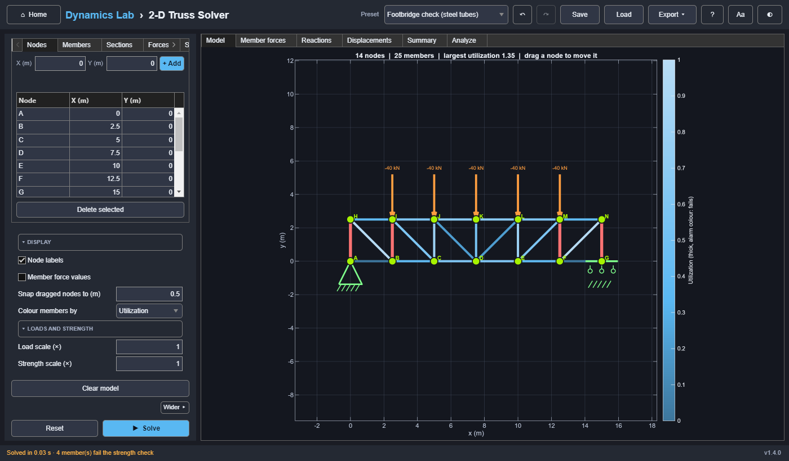

# 2-D Truss Solver

Linear-elastic, pin-jointed 2-D trusses, solved with the direct stiffness method. It computes
member forces, support reactions, and nodal displacements, and checks every member's strength:
its stress against the yield stress of its material and, when it is pushed, its force against
the load that buckles it. This is a static solver, with no time axis or playback.



## Model

Each bar contributes an axial stiffness matrix `EA/L` in global coordinates. The free degrees of
freedom solve `K U = F`. Member forces follow from the elongations, and reactions from `K U − F`.

**Sign convention:** positive member force is **tension**, negative is **compression**.

**Sections:** each member has a section (a row of the **Sections** table) with its own E and A,
so an indeterminate truss shares its loads by stiffness (stiffer members attract more). A
determinate truss's forces do not depend on E or A, only its displacements do.

**Strength check:** for each member, with N its force, A its area, I its second moment of area
(about the weakest axis), and L its length:

```text
stress            σ = N / A
buckling load     P_cr = π² E I / L²          (Euler, pin-ended: the effective length is L)
utilization       u = max(|σ| / (s σ_yield),  |N| / (s P_cr) when N < 0)
safety factor     1 / max(u)
```

s is the **Strength scale** (default 1), a multiplier on every member's yield stress and
buckling load, so the utilizations divide by it and the governing mode does not change; the
Sections table keeps its nominal values. With it the Uncertainty tab can scatter the strength as
well as the load.

A member with u > 1 fails, by yielding or by buckling, whichever ratio is larger. Because the
model is linear, the safety factor is also the load multiplier at which the first member reaches
its limit (set **Load scale** to it and the largest utilization becomes 1).

**Scope:**
- pin-jointed bars with axial stiffness only
- linear elasticity and small displacements
- nodal loads (scaled together by Load scale); no self-weight
- SI units, with sections in mm, cm², cm⁴, GPa, and MPa
- the check is a check, not a failure simulation: a failed member is not removed, loads are not
  redistributed, there is no plasticity or behaviour after buckling, and connections are not
  checked

It applies no design-code factors (material or load partial factors, buckling curves for
imperfect members), so it is a teaching tool, not a design tool: real members buckle somewhat
below the Euler load.

The solver rejects these models with a message:
- mechanisms (a singular stiffness matrix)
- zero-length members
- missing supports
- invalid node references

## Editing on the canvas

Nodes can also be moved with the mouse: press a node on the **Model** canvas and drag it. Its
members follow it while you drag, with its coordinates shown beside it. Releasing it changes the
model once, as a single undo step (Ctrl+Z puts it back), and marks earlier results as out of date,
like any table edit. Positions snap to a grid (**Snap dragged nodes to**, 0.5 m by default, 0 to
turn it off). A press that moves only a few pixels is a click and changes nothing. Dragging is
disabled while a solve runs.

## Inputs

The left panel is a model editor with five tables:

| Table | Columns | Notes |
|---|---|---|
| Nodes | X, Y (m) | Named A, B, …, Z, AA, … Deleting a node removes the members, forces, and supports that use it, and renumbers the rest. |
| Members | Node 1, node 2, section | Edits that name a missing node, the same node twice, or a missing section are rejected. A new member takes the section of the one before it. |
| Sections | Material, E (GPa), yield (MPa), shape, D and t (mm), A (cm²), I (cm⁴) | Picking a material fills in E and the yield stress; picking a shape computes A and I from the outer size D and the wall t. Typing E or the yield stress makes the material custom; typing A or I makes the shape custom. A section in use, or the last one, cannot be deleted. |
| Forces | Node, Fx, Fy (N) | Loads at nodes. |
| Supports | Node, type | Pin (X and Y fixed), roller fixing X, or roller fixing Y. One support per node. |

- **Loads and strength:** Load scale, multiplying every load in the Forces table, and Strength
  scale, multiplying every member's yield stress and buckling load (both default 1; sweepable).
  Scenarios saved before the strength scale existed load with 1.
- **Display:** node labels, member force values (off by default; labels overlap on dense
  trusses), snapping, and whether members are coloured by utilization (the default) or by
  tension and compression. These redraw without needing a new solve.
- **Clear model** empties the editor.

**Materials** (typical design values): A36 structural steel, E = 200 GPa, yield 250 MPa;
aluminium 6061-T6, 69 GPa, 276 MPa; C24 structural softwood, 11 GPa, 21 MPa (its characteristic
compressive strength along the grain, used here for tension too); or custom.

**Shapes:** round tube (D outer diameter, t wall), solid rod, square box (D outer side, t wall),
solid square, or custom (A and I typed in).

The default section, S1, is A36 steel with A = 100 cm² (the solver's original 0.01 m²) and
I = 8820 cm⁴ (about a 273 × 12.7 mm tube). Scenarios saved before sections existed load their
single E and A as S1.

**Presets:** simple triangle (the default), 6-panel Pratt, Warren, and Howe trusses, a cantilever,
a Fink roof truss, and two strength checks: a 15 m Pratt footbridge in steel tubes (88.9 × 4 mm
chords, 60.3 × 3.2 mm web, 40 kN per node, with a 76.1 × 3.2 mm tube as a spare section), whose
web posts buckle; and the Fink roof in 75 mm square timber under twice the roof load (100 mm as
a spare), whose rafters buckle.

## Outputs

- **Model:** the canvas, which updates live while you edit; the loads are drawn and labelled as
  solved, Load scale included. After a solve, members are coloured by utilization (0 to 1, with
  a colour bar; failing members thick, in the alarm colour), or red for tension and blue for
  compression.
- **Member forces** (force in kN, state, section, stress, utilization, and what governs: yield
  or buckling, marked FAILS above 1; nothing for a zero-force member), **Reactions** (kN),
  **Displacements** (mm) (tables).
- **Summary:** the largest tension, compression, and displacement; the largest utilization, the
  safety factor ("— (no load)" without loads), how many members fail, by buckling and by
  yielding, and the governing member and mode (with how many more share its utilization); then
  the member and degree-of-freedom counts.
- **Export:** per member: its name, force (N), state, stress (Pa), Euler load π²EI/L² (N, for
  every member; it governs only in compression), utilization, and governing mode. The MAT export
  also holds the reactions and displacements.

## Reference results (asserted by the tests)

| Preset | Member | Force | State |
|---|---|---:|---|
| Simple triangle (20 kN at C) | A-B | 5.774 kN | Tension |
| | B-C, A-C | −11.547 kN | Compression |
| Pratt (five 12 kN loads) | A-B | 0 | Zero-force |
| | D-E | 32.000 kN | Tension |
| | J-K | −36.000 kN | Compression |
| | B-H | 36.056 kN | Tension |
| Fink roof (40 kN total) | bottom chords | 26.667 kN | Tension |
| | outer rafters | −33.333 kN | Compression |
| | king post | 10.000 kN | Tension |

In the Pratt truss, all six diagonals are in tension. In the Howe truss, all six are in
compression.

| Strength check | Value |
|---|---:|
| Two bars, 30 kN: 3 m tie (A = 1 cm², σ_y = 250 MPa), 5 m strut (A = 4 cm², I = 200 cm⁴, E = 70 GPa) | 22.5 kN tension (u = 0.90, yield), 37.5 kN compression (u = 0.68, buckling: P_cr = π²EI/L²) |
| Two parallel bars, areas 1 : 2, 3 kN | 1 kN and 2 kN (load shared by stiffness) |
| Footbridge, 60.3 mm web | 4 members fail, all by buckling |
| Footbridge, 76.1 mm web | every member holds; safety factor = 1 / largest utilization |
| Footbridge, strength scale 2.5 | every utilization ÷ 2.5 exactly; forces and governing modes unchanged |

## Lessons

**Tension, compression, and stiffness** solves the triangle and the Pratt truss, doubles E to
show that a determinate truss's forces do not change, and sweeps the load scale. **Will it hold?**
checks the steel footbridge (its web buckles), fixes it with a wider tube, reads the safety factor
(and sets the load scale to it), and fixes a timber roof truss. **Uncertain loads** scatters the
footbridge's load in a Monte Carlo study, spends the margin, and then scatters the strength too:
with 10 % on each, the variance splits about evenly between them.
